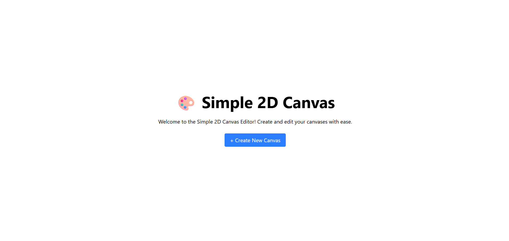

# 🖌️ Simple 2D Canvas Editor

A lightweight web-based 2D **Canvas Editor** built using **React**, **Fabric.js**, and **Firebase Firestore**.  
Users can draw shapes, add text, use a pen tool, move and resize objects, change colors, and save or reload their work.

---

## 📸 Preview

### 🏠 Home Page


### 🎨 Canvas Editor


> *(Add screenshots in a folder named `screenshots` inside your project root.)*

---

---

## 🚀 Features

### 🏠 Home Page
- Minimal landing page with a **“Create New Canvas”** button.
- On click:
  - Creates a new document in **Firestore**.
  - Redirects to `/canvas/:canvasId`.

### 🎨 Canvas Editor
- Built with **Fabric.js** for smooth 2D drawing and editing.
- Tools available:
  - 🟦 **Rectangle**
  - ⚪ **Circle**
  - ✏️ **Pen Tool (free drawing)**
  - 🅰️ **Text**
- Other controls:
  - Move, resize, rotate, and delete objects.
  - Change object color.
  - Save and reload canvas state from Firestore.

---

## 🧠 Tech Stack

| Layer | Technology |
|-------|-------------|
| Frontend | React + Tailwind CSS |
| Drawing Engine | Fabric.js |
| Database | Firebase Firestore |
| Deployment | Vercel |

---

## 🛠️ Project Setup

### 1️⃣ Clone and Install
```bash
git clone https://github.com/imrancodes/canvas-editor.git
cd canvas-editor
npm install
```

### Add your Firebase configuration inside .env
```bash
VITE_API_KEY=your_api_key
VITE_AUTH_DOMAIN=your_project.firebaseapp.com
VITE_PROJECT_ID=your_project_id
VITE_STORAGE_BUCKET=your_storage_bucket
VITE_MESSAGING_SENDER_ID=your_sender_id
VITE_APP_ID=your_app_id